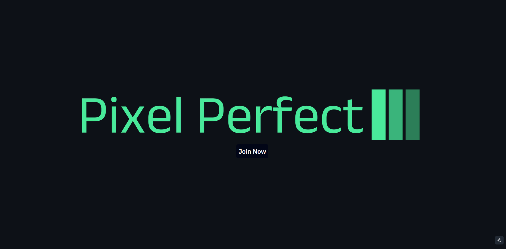

  <h3 align="center">Pixel Perfect - Imporve Your Media Using AI</h3>
  

    
    
    
    
    
    
    
  

## 📋 <a name="table">Table of Contents</a>

1. 📎 [Introduction](#introduction)
2. ⚙️ [Tech Stack](#tech-stack)
3. 💻 [First Look](#first-look)
4. 😎 [About Me](#about-me)

## <a name="introduction">📎 Introduction</a>

Unleash your creativity with our AI-powered image transformer. Explore a suite
of features to enhance your images:

- Secure user access and control with registration, login, and route protection.
- Community showcase: Discover user transformations and find inspiration.
- Advanced search: Find specific images based on content or objects.
- Image restoration, recoloring, and generative fill: Enhance and customize
  images with ease.
- Object and background removal: Clean up and extract objects with precision.
- Download transformed images, view details, and manage transformations: Track
  and control your edits.
- Credits system: Earn or purchase credits for continued use.
- Profile page and secure credit purchases: Manage your images and buy credits
  seamlessly.
- Responsive UI/UX: Enjoy a smooth experience on any device.

Transform your images and create stunning visuals with this powerful platform.

## <a name="tech-stack">⚙️ Tech Stack</a>

- Next.js
- TypeScript
- MongoDB
- Clerk
- Cloudinary
- Stripe
- Shadcn
- TailwindCSS

## <a name="first-look">💻 First Look</a>

✨ Welcome to Pixel Perfect! Enhance your visual content with the power of
AI-powered image and video transformations. Let Pixel Perfect elevate your media
with ease! 

Pixel Perfect streamlines user authentication with a seamless Clerk integration,
ensuring a smooth and secure experience.

🪄 Explore Diverse Media Transformations:

- Background Removal: Isolate your subjects beautifully by removing unwanted
  backgrounds with a single click.
  

- Generative Fill: Unleash creativity by intelligently filling missing areas in
  your images with AI-generated content.
  

- Image Restoration: Breathe new life into old or damaged photos with AI-powered
  restoration, repairing noise, scratches, and imperfections.
  

- Object Replacement: Replace unwanted objects seamlessly with a different
  object of your choice, creating an ideal composition.
  

- Recolor Object on Image: Modify the color of a specific object within your
  image while preserving the surrounding elements.
  

- Object Removal: Remove unwanted objects from your images with precision,
  leaving a clean and clutter-free result.
  

** Stay Tuned for Video Transformations:** Exciting new features for video
transformations are coming soon, providing even more comprehensive media
enhancement capabilities.

I take insipration to create this app from:
https://www.youtube.com/watch?v=Ahwoks_dawU&t=8795s

## <a name="about-me">😎 About Me</a>

Hello this app was created by me! Enjoy. If you have any question, feel free to
create new issue ticket. Otherwise you can contact me via my socials or email:

- 📱 <a href="https://www.linkedin.com/in/emil-szymczyk-209613209/">linkedin</a>
- 📧 email: emil-szymczyk2@wp.pl
